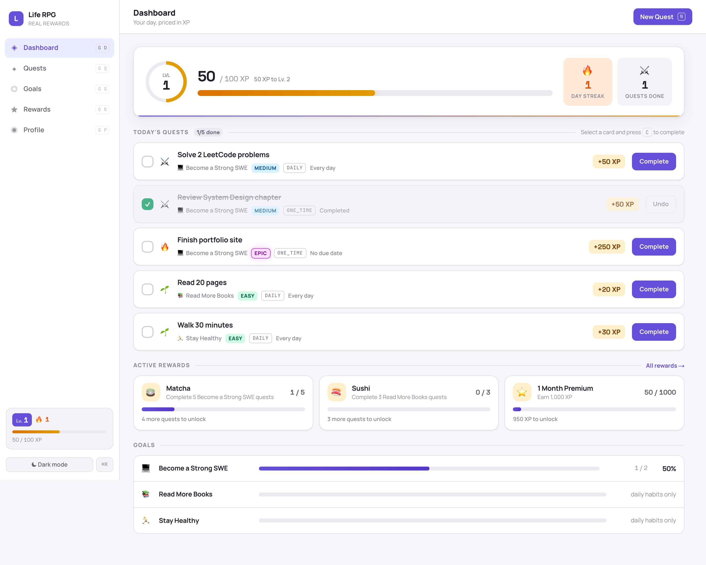
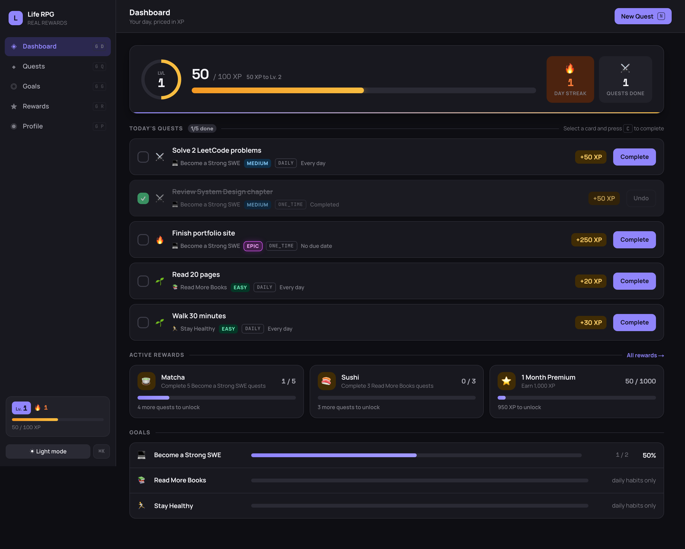
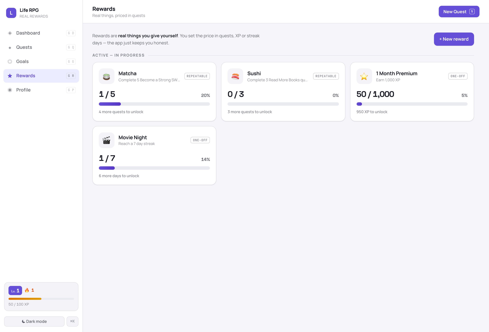

# Life RPG

**A productivity app that gamifies your life — except the rewards are real.**

Turn your goals into **quests**, complete them to earn **XP**, keep a **streak**, and unlock rewards **you define yourself**: 10 DSA quests for one real cup of matcha.

What makes it different from Habitica and friends: they pay you in virtual gold and virtual armor — the human brain stops caring about that pretty fast. Here the reward has real value, which makes the mechanic closer to a **commitment device** than to gamification.



<table>
<tr>
<td width="50%"></td>
<td width="50%"></td>
</tr>
</table>

---

## Stack

| Layer | Choice |
|---|---|
| Framework | Next.js 16 (App Router), TypeScript strict |
| API | tRPC v11 + TanStack Query |
| Database | PostgreSQL + Drizzle ORM |
| UI | Tailwind CSS v4, oklch design tokens, light/dark |
| State | Zustand (UI) · TanStack Query (server) |
| Testing | Vitest (60) · Playwright (5) |

## Running it

```bash
pnpm install
docker compose up -d          # PostgreSQL 17 on port 5432
cp .env.example .env
pnpm db:push
pnpm db:seed
pnpm dev                      # http://localhost:3000
```

Keyboard shortcuts: `N` new quest · `R` new reward · `C` complete the selected quest · `G`+`D/Q/G/R/P` jump between screens · `⌘K` command palette · `Esc` close.

## Testing

```bash
pnpm test        # 60 tests: 44 unit (domain, no DB needed) + 16 integration
pnpm e2e         # 5 Playwright tests — the §33 main flow through the real UI
pnpm typecheck
pnpm lint
```

Integration tests skip themselves when `DATABASE_URL` is absent. `pnpm e2e` starts the dev server itself and resets the database to a "brand new user" state before running.

---

## Engineering decisions worth noting

This is the most interesting part of the project. The first spec had **10 design flaws**, all found and fixed *before* a single line of code was written — details in [spec.md](spec.md), with a v1 → v2 comparison table at the top of the file.

**Separate the definition from the event.** `Quest` (the definition) is split from `QuestCompletion` (the event, append-only). That one split solves four problems at once: daily recurring quests, completion history, reward progress counting, and undo.

**XP is a ledger, not a counter.** No `player.totalXp += n`. Every XP change is a row in `xp_transaction`; an undo writes a reversing row instead of deleting the original. That makes undo both reversible and auditable.

**Baseline for rewards.** Spec v1 counted *all* previously completed quests, so a user who had already done 50 quests and then created a "10 quests" reward would unlock it instantly. Each reward now snapshots the current value at creation time, turning the condition into "do 10 more from now on".

**Streaks follow the user's timezone and decay lazily on read.** No cron jobs. The streak decays at read time, based on `lastActiveDate`. The critical boundary: activity yesterday with nothing done today does **not** break the streak yet — get this wrong and users who open the app in the morning see their streak at 0.

**Architectural boundaries are enforced by imports.** `src/domain/` imports neither Drizzle, tRPC, nor Next. All the game rules are therefore testable in 300ms without a database — and that's exactly where most of the bugs will live.

**Every operation that touches progression runs in a single transaction.** Completing a quest touches 6 tables; a crash halfway through would leave state like "quest done but XP not credited, reward already unlocked". The driver is `postgres.js` rather than `neon-http`, because `neon-http` doesn't support transactions.

**Design tokens stay in oklch.** Raw variables are defined on `:root` / `[data-theme="dark"]` and mapped to Tailwind v4 utilities via `@theme inline`. That way `bg-surface` / `text-ink` / `shadow-e1` follow the theme without writing every class twice with a `dark:` variant.

## Architecture

```
src/domain/            game rules, plain TypeScript, unaware a database exists
  date.ts                LocalDate — dates in the user's timezone
  leveling.ts            levelFromXp / xpForLevel / levelProgress
  streak.ts              applyCompletion / readStreak / computeStreakFromDates
  rewards.ts             baselineFor / progressOf
src/server/db/         Drizzle schema (9 tables)
src/server/services/   transactions: completeQuest, undoComplete, claimReward
src/server/trpc/       routers: player, goal, quest, reward, notification
src/config/            current-user.ts — the single place userId comes from
src/app/(app)/         5 screens: dashboard, quests, goals, rewards, profile
src/components/        ui/ · shell/ · overlays/
e2e/                   Playwright — the §33 main flow
```

## Documentation

- [spec.md](spec.md) — product and technical specification (v2, with the table of 10 fixed flaws)
- [PLAN.md](PLAN.md) — the 7-phase plan, exit criteria per phase, list of required tests
- [DESIGN_PROMPT.md](DESIGN_PROMPT.md) — the prompt used to build the UI

## Progress

- ✅ Phase 0 — domain model + game rules + tests
- ✅ Phase 1 — core loop (complete / undo / claim)
- ✅ Phase 2 — reward engine + the §33 main flow
- ✅ Phase 3 — 5 screens matching the design
- 🟡 Phase 4 — juice (remaining: sound, XP count-up numbers)
- ⬜ Phase 5 — authentication
- ⬜ Phase 6 — deployment
